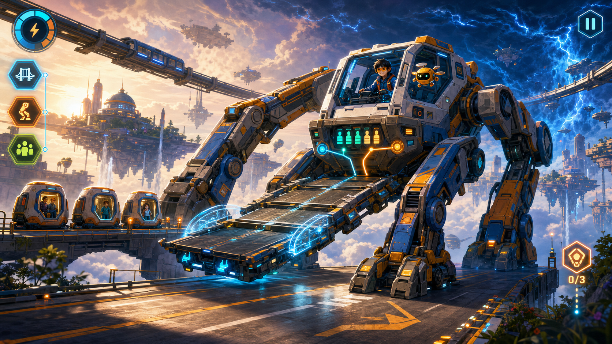
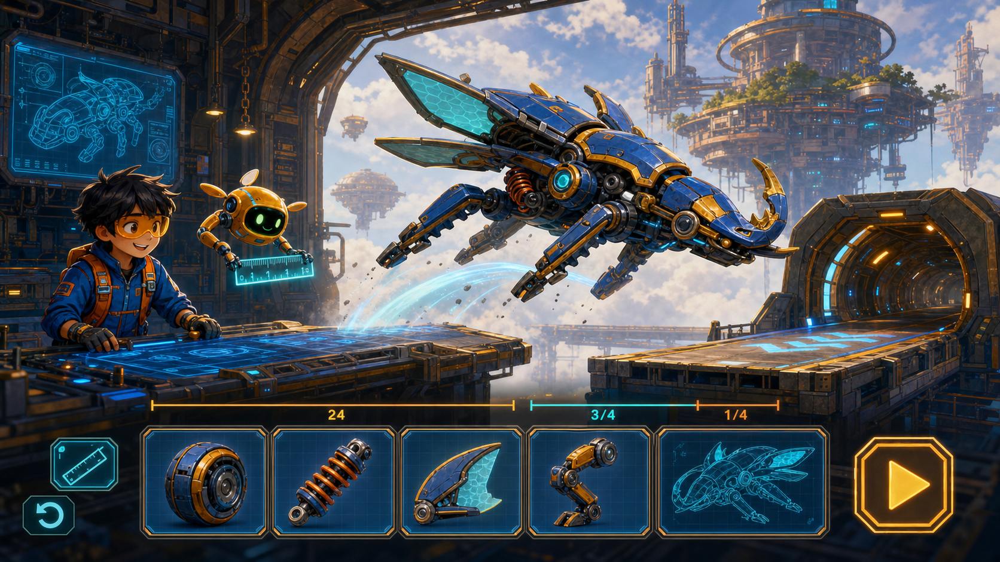
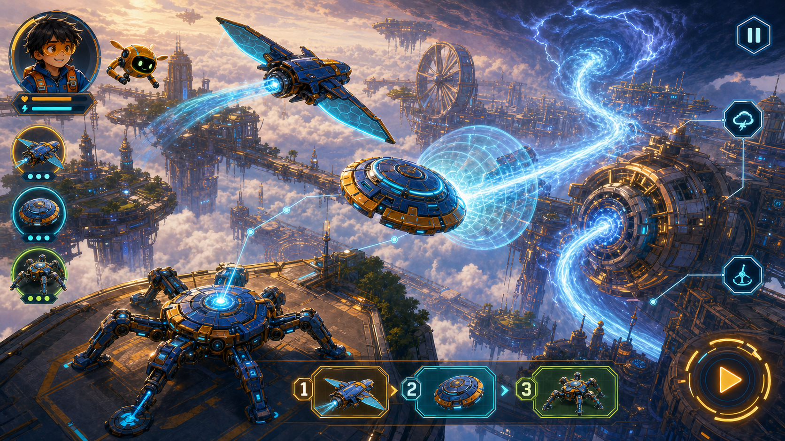

# Bright Quest Transforming Worlds

## Three-game product design brief

**Date:** 20 July 2026

**Status:** Mechshift Rescue is the selected first build. Gearbeast Foundry and Skyguard Command remain design-only.

**Audience:** A capable Grade 4 child, represented in the concept art by the same boy pilot, who loves original transforming robots and vehicles, heroic machines, dramatic reveals, collecting parts, bosses, speed, and customization.
**Release gate added 20 July 2026:** Do not push the game change to the live Bright Quest site until the landing page includes a clear **Sign up** button and successful family signup continues to a dedicated **Nominate your kid** step. The flow must use the current family-auth API and child-profile model, keep Parent Cockpit security intact, and pass local QA before deployment.

## Portfolio decision

The three existing themes should not be redesigned. The new portfolio deliberately leaves pirates, street safety, and cave rivers behind and starts from a blue-sky child fantasy: **I have a team of transforming machines, and my thinking makes spectacular things happen.**

The proposed umbrella is **Bright Quest: Transforming Worlds**. It shares one original-IP pilot identity, one round amber helper drone, a cobalt/orange machine language, and collectible Lumen Cores. The games are not reskins:

| Game | Primary fantasy | Main mechanic | Learning territory |
| --- | --- | --- | --- |
| **Mechshift Rescue** | Drive a huge rescue vehicle that transforms at the exact heroic moment | Real-time navigation, form switching, carrying and route decisions | Multi-step arithmetic, capacity, elapsed time, multiplicative reasoning |
| **Gearbeast Foundry** | Build a transforming mechanical creature, then watch it survive a physical test course | Modular construction, measurement, tuning and physics testing | Fractions, geometry, measurement, spatial reasoning |
| **Skyguard Command** | Command a squad of transforming sky machines through a cinematic crisis | Pause-and-plan tactics, evidence linking, command sequencing | Reading inference, grammar, cause/effect and logic |

### Original-IP boundary

The portfolio may use the broad fantasy of machines changing form, but it must not use franchise names, insignia, character shapes, color blocking, transformation choreography, lore, dialogue, music, or marketing language. Every silhouette must begin from its gameplay job: rescue tool, mechanical animal, or sky utility craft.

## Shared design pillars

1. **The reasoning is the machine.** A child allocates seats, spans a gap, balances a build, links evidence, or sequences commands. A detached multiple-choice panel is never the primary learning interaction.
2. **Three verbs in ten seconds.** The child should move, transform, and affect the world almost immediately. Story setup stays under 35 seconds and is skippable after the first play.
3. **Spectacle follows causality.** The biggest transformation, rescue, or squad combo happens because of a visible player decision, not an automatic cutscene.
4. **Readable cinematic art.** Richly painted depth surrounds a simple foreground play lane. One hero machine, one immediate hazard, one objective, and one primary action dominate each frame.
5. **Competence without punishment.** A wrong plan causes a useful physical consequence, then offers rewind, reconfigure, or a stepped hint. Nobody is harmed and completion is always recoverable.
6. **Collect meaningfully.** Rewards unlock new functional side-grades, test-course variations, visual parts, color finishes, and replay routes. No loot boxes, paid pressure, public rankings, or infinite streak anxiety.

## Grade 4 difficulty model

All three games use the same three-band reasoning ladder, but in different curriculum territories.

- **Band A — Represent:** Two linked steps with concrete objects and visible quantities. The child can drag, group, measure, or connect evidence.
- **Band B — Plan:** One quantity or relationship must be inferred before acting. Distractors represent plausible misconceptions, not silly answers.
- **Band C — Transfer:** The child chooses between viable plans under a resource, route, or timing constraint and can explain why the chosen plan works.

Within a session, the game adjusts number size, clue density, and hint depth from the current run only. It does not infer sensitive traits or expose a hidden ability label. Each reasoning event has a solution trace, a three-step hint ladder, a worked explanation after recovery, and at least one alternate data set for replay.

The minimum accepted content is more demanding than one-step recall. For example, `6 bags × 24 coins` is an acceptable multiplication component, but a production challenge should add a decision or second step: **six supply pods hold 24 cells each; 38 cells are used to power the bridge. How many remain for the rescue machines?**

---

# Game 1 — Mechshift Rescue

## Fantasy and learning objective

The child pilots **Relay-7**, an enormous original rescue machine that transforms between **Rover**, **Lift Mech**, and **Bridge Crawler** to save a floating city during a magnetic storm.

The learning objective is to solve multi-step arithmetic and planning problems involving multiplication, division with remainders, capacity, elapsed time, and comparison. The child demonstrates understanding by loading, routing, timing, and transforming the machine correctly.

## Core gameplay loop and agency

**Scan → choose a route → drive → transform → manipulate the rescue → see the consequence → adapt.**

Player agency verbs: **drive, scan, transform, lift, allocate, reroute, rescue.**

- Rover form is fast and can carry pods.
- Lift Mech form moves heavy wreckage but uses more charge.
- Bridge Crawler anchors across gaps but cannot carry civilians while deployed.
- The player chooses which problem to solve first, which form to spend charge on, and when to take a safer route.

The world never freezes for a quiz. A rescue console exposes physical slots, meters, route lengths, clocks, and movable groups. The player's configuration is the answer.

## 8–12 minute session

| Time | Beat |
| --- | --- |
| 0:00–0:35 | Storm alert, one-line objective, immediate Rover launch |
| 0:35–2:30 | District scan and first low-risk rescue teaches the three forms |
| 2:30–5:00 | Capacity rescue: load pods and choose a route before a bridge closes |
| 5:00–7:30 | Heavy-lift rescue combines charge budgeting with elapsed time |
| 7:30–10:00 | Hero set-piece: a three-form transformation chain stabilizes a sky bridge |
| 10:00–11:00 | Debrief, replay route reveal, Lumen Core and machine-part reward |

## Challenge escalation, fail and recovery

- Early challenges show all quantities on the world objects.
- Mid-session challenges hide one useful total inside a scan readout.
- The finale offers two valid plans: a quick high-charge route and a slower efficient route.
- A poor configuration causes overheating, a dropped *cargo container* onto a safe magnetic cradle, or a route closure—not injury.
- The helper drone freezes the last five seconds, highlights the conflicting quantity, and offers **Rewind**, **Reconfigure**, or **Show the first step**.
- Recovery costs only a small optional mastery star. It never blocks completion or deletes earned progress.

## Integrated content examples

**Capacity rescue:** Three pods hold 8 people each. Five seats are reserved for medics. The player must drag the correct number of evacuee figures into the remaining seats, then choose whether the Rover can take everyone in one trip. The reasoning is `3 × 8 = 24`, then `24 − 5 = 19`.

**Charge planning:** Six battery racks hold 24 cells each. The bridge deployment uses 38 cells. The player allocates the remaining cells between a 60-cell lift and two 20-cell rover boosts. The game accepts more than one workable plan and scores efficiency separately from correctness.

**Elapsed-time route:** The east ramp takes 3 minutes, a lift takes 2 minutes, and returning in Rover form takes 4 minutes. A storm gate closes in 11 minutes. The child sequences the operations and sees the city clock advance with each command.

## Progression, replayability and reward

- Sessions rotate district layouts, quantities, weather modifiers, and rescue order.
- New parts are side-grades: a longer bridge, an efficient lift, or a faster rover, each with a trade-off.
- A three-star debrief separates **Safe**, **Smart**, and **Swift** so speed never replaces reasoning.
- The reward is a new Relay-7 module, a color finish, and a visible repaired city landmark added to the shared hangar mural.
- The child replay hook is: **“I want to do the whole rescue with the crawler route this time.”**

## Controls

- **Desktop:** WASD or arrows to drive; pointer to select world objects; `1`, `2`, `3` or a radial button to transform; Space to act; Escape to pause.
- **Tablet:** left-thumb steering pad; large right-thumb transform wheel; tap/drag world objects; hold to preview a route; no precision drag smaller than 44 CSS pixels.
- Driving has generous auto-steer near interactable objects. Transform controls lock only during a short, cancel-safe transition.

## World map and key screens

1. **Shared Hangar:** the child pilot, helper drone, Relay-7, three large form silhouettes, and one Start Mission action.
2. **Floating City Map:** three rescue districts connected by visible routes; the chosen district expands instead of opening a card grid.
3. **Playable District:** three-quarter camera, uncluttered road lane, painted depth, one hazard and one rescue target.
4. **Transformation Hero Frame:** low camera, warm emergency light, panels unfolding around a clearly protected civilian zone.
5. **Debrief Bay:** the repaired landmark, solution replay, new module, and one Replay Another Route action.

## Character, environment, HUD, motion, audio and feedback

- The default pilot is the same dark-haired Grade 4 boy in all keyframes, wearing a cobalt jacket with orange safety panels and an amber visor. The production avatar can later be customizable.
- Relay-7 is friendly but formidable: broad rescue shoulders, visible crane geometry, rubberized tools, expressive light strip, no weapon silhouette.
- The city uses painted cloud canyons, suspended transit lines, warm sunrise shafts, cobalt storm fronts, and small human-scale details for awe without visual noise.
- HUD: objective strip, charge ring, form wheel, compact city clock, pause/return. No score-card stack.
- Motion motifs: mechanical fold-and-lock, suspension compression, magnetic bridge bloom, dust/wind wake, camera settle after impact. Reduced motion replaces the transform spin with a 180 ms silhouette crossfade and a single lock sound.
- Audio: weighty servo layers, clear form identity, wind bed, optimistic orchestral-electronic pulse, spatial rescue pings, and short voiced guidance that never reads every line on screen.

## Assets and implementation approach

- 6 painted district plates split into foreground/midground/background layers
- Relay-7 three-form rig plus 8 transition clips and 12 gameplay clips
- child pilot, helper drone, evacuee group, 4 rescue props, 6 modular hazards
- form wheel, route markers, charge meter, objective icons, feedback states
- 3 music stems, 25–35 SFX, 10 short voice lines, captions
- Phaser 4.1 with Arcade Physics for movement and bespoke transform state machines; Tiled JSON for routes and encounter markers; lazy-loaded WebP/AVIF backgrounds and packed sprite atlases

## Acceptance criteria

- A first-time child can drive, transform, and begin the first rescue within 45 seconds without adult help.
- At least 80% of learning actions happen through load, route, clock, or world manipulation—not answer buttons.
- Every wrong configuration produces a visible, explainable consequence and a recovery choice within 3 seconds.
- The three forms solve genuinely different problems; none is a cosmetic skin.
- A full session completes in 8–12 minutes at normal reading speed.
- Tablet controls remain reachable in landscape and portrait-safe fallback; all targets are at least 44 × 44 CSS pixels.

---

# Game 2 — Gearbeast Foundry

## Fantasy and learning objective

The child is the chief inventor in a sunlit orbital workshop, building an original transforming mechanical creature from wheels, legs, wings, armor, springs, and sensor parts—then testing it on a short cinematic course.

The learning objective is to reason about fractions, length, perimeter, area, angles, symmetry, mass distribution, and spatial relationships. The build behaves according to the child's measurements, so mathematics is visible in motion.

## Core gameplay loop and agency

**Inspect the course → choose a body plan → measure → snap and tune parts → test → diagnose → rebuild → conquer the course.**

Player agency verbs: **measure, rotate, snap, balance, tune, test, rebuild.**

Parts attach to a large grid-backed workbench. The player can scrub a transparent motion preview before committing. A beast may roll, climb, glide, or brace; no single “correct robot” exists if the constraints are met.

## 8–12 minute session

| Time | Beat |
| --- | --- |
| 0:00–1:00 | Inspect a three-obstacle course and choose a creature chassis |
| 1:00–3:30 | Build the travel form with measurement and symmetry tools |
| 3:30–5:00 | First test exposes a readable physical weakness |
| 5:00–7:30 | Rebuild with one new part and a fraction/area constraint |
| 7:30–10:00 | Full course: transform between travel and power forms |
| 10:00–11:00 | Slow-motion finish, blueprint reward, workshop shelf update |

## Challenge escalation, fail and recovery

- Early commissions use a visible square grid and ghosted attachment points.
- Later commissions ask the child to derive one measurement from the course.
- The finale combines clearance, balance, and a limited-part budget.
- Failure is playful: a wheel spins, a long body high-centers, or parts release into soft magnetic catchers.
- The game overlays the run trace, highlights the exact contact or imbalance point, and lets the child rewind directly to the workbench with the build intact.
- Hints progress from **show the measurement tool**, to **mark the conflicting length**, to **demonstrate one valid adjustment**.

## Integrated content examples

**Fraction bridge:** A 24-unit bridge deck is available. The chassis covers `3/8` of it and the folded ramp covers `1/4`. The child measures the two pieces as 9 and 6 units, then builds a 9-unit tail section from available modules. The completed creature physically spans the bridge.

**Perimeter armor:** A rectangular battery panel is 6 units by 4 units. The child has 18 units of edge armor and must discover that the full perimeter needs 20, then choose a two-unit corner-saving brace with a stated trade-off.

**Angle and clearance:** A wing can fold at 30°, 60°, or 90°. The child previews which angle fits a tunnel while still giving enough lift for the next gap.

## Progression, replayability and reward

- Commissions remix obstacle order, part budgets, target abilities, and decorative themes.
- Multiple valid builds receive named badges such as **Elegant**, **Tough**, **Efficient**, or **Surprising**.
- Blueprints unlock functional side-grades and visual parts; no random paid drops.
- Every completed creature appears as a moving miniature on the Foundry shelf and can be brought into a free-play test yard.
- The child replay hook is: **“Mine nearly flew over the whole tunnel—let me move the wings.”**

## Controls

- **Desktop:** pointer drag/drop, wheel or `Q/E` rotate, Shift for symmetry placement, Space to test, Z to undo.
- **Tablet:** direct drag, two-finger rotate, pinch zoom, large rotate buttons as an alternative, magnetic snap zones, persistent Undo.
- All fine positioning snaps to semantic grid units; the child never needs pixel-perfect placement.

## World map and key screens

1. **Commission Window:** one moving preview of the course, three required capabilities, one Build action.
2. **Foundry Workbench:** the creature dominates the canvas; parts live in a shallow bottom rail, not card stacks.
3. **Measurement View:** translucent ruler, angle fan, balance line, and live dimension labels attached directly to parts.
4. **Test Course:** side-on painted track with clear foreground collision surfaces and spectacular background scale.
5. **Slow-Motion Finish:** the creature changes form over the final gap, camera tracking its original player-built silhouette.

## Character, environment, HUD, motion, audio and feedback

- The same pilot and amber helper drone operate the workshop; the drone physically holds the ruler and points to stress points.
- Gearbeasts look like friendly industrial animals—not humanoid franchise robots. Silhouettes derive from stag, beetle, manta, and hound locomotion without copying character designs.
- The Foundry is warm and tactile: painted brass, cobalt ceramic, rubber grips, sunlight, floating dust, distant cloud docks.
- HUD: part budget, three capability meters, Undo, transform preview, Test. Measurements live on the build rather than in a floating quiz panel.
- Motion motifs: magnetic snap, telescoping limbs, spring compression, material flex, slow-motion transformation. No constant UI bobbing.
- Audio: satisfying clicks by material, servo chirps, workshop percussion, rising test-course music, and an audible “clean lock” when a measurement constraint is met.

## Assets and implementation approach

- 4 layered Foundry/workbench plates and 5 test-course themes
- 4 base creature silhouettes; 24 modular functional parts; 18 cosmetic parts
- attachment sockets, measurement overlays, angle fan, stress trace, build ghost
- 10 transformation families assembled from modular clips
- 3 music stems, 40 material/impact SFX, 8 helper-drone lines, captions
- Phaser 4.1 plus Matter Physics for joints, mass, constraints, collision and replays; TexturePacker atlases with authored pivots; deterministic fixed-step simulation for reproducible QA

## Acceptance criteria

- A child can understand the commission, place the first part, and start a preview within 60 seconds.
- At least three visibly different builds can solve each production commission.
- Measurements change real collision, reach, balance, or movement—not only a score label.
- Test failure identifies a physical cause and returns to the intact build in under 4 seconds.
- Undo always works; no configuration can permanently dead-end the session.
- The full build/test/rebuild arc fits 8–12 minutes and holds 45+ FPS on the target tablet profile.

---

# Game 3 — Skyguard Command

## Fantasy and learning objective

The child becomes mission commander for three transforming sky machines—**Glider**, **Shield**, and **Crawler**—protecting a cloud city from a rogue weather engine and non-sentient drones.

The learning objective is to combine reading evidence, resolve pronoun and reference chains, understand conjunctions and cause/effect, infer unstated relationships, and sequence a logical plan. Language becomes tactical intelligence.

## Core gameplay loop and agency

**Scout → collect evidence → link meaning → draw routes → queue commands → execute → interrupt and transform → review the consequence.**

Player agency verbs: **scout, inspect, connect, command, transform, flank, shield.**

Time slows while the child plans. Evidence appears on the actual map as radio fragments, signs, movement trails, and character observations. The player connects two or three pieces, assigns bots, and draws a command sequence. When time resumes, the plan plays out immediately. A sentence is useful because it changes what the squad does.

## 8–12 minute session

| Time | Beat |
| --- | --- |
| 0:00–0:40 | Sky alert and squad launch |
| 0:40–3:00 | Scout encounter teaches evidence linking and command queue |
| 3:00–5:30 | Split-route rescue introduces pronoun/reference inference |
| 5:30–8:00 | Weather-engine approach adds cause/effect and transform timing |
| 8:00–10:30 | Boss set-piece: three-bot combo redirects the storm beam |
| 10:30–11:30 | Tactical replay, alternate plan reveal, signal-core reward |

## Challenge escalation, fail and recovery

- First encounter uses two clues and one obvious map consequence.
- Second encounter uses three clues, an irrelevant detail, and two viable routes.
- The finale requires a command order plus one live transformation interrupt.
- A flawed inference causes a bot to reach a locked route, lose shield charge, or get pushed to a safe fallback platform.
- The timeline pauses, highlights which command contradicted which clue, and rewinds to the last decision point.
- The helper drone can read a clue aloud, underline referents, or show a cause/effect arrow without selecting the final plan.

## Integrated content examples

**Reference-chain mission:** The radio says, “The glider crossed the red tower before it lost signal. The unit carrying the blue beacon was behind it, but that unit never crossed the tower.” The child links **it** to the glider, places the signal-loss marker beyond the red tower, and sends Shield to the correct search sector.

**Cause/effect command:** “Because the west turbines are frozen, the lift bridge will stay down unless Crawler warms both relays.” The child queues **Crawler → west relay → east relay → bridge**, then routes Glider only after the bridge condition changes.

**Grammar-as-precision:** The child repairs an ambiguous command by moving a modifying phrase next to the bot it describes. The corrected placement changes which unit transforms, and the animation confirms the meaning.

## Progression, replayability and reward

- Encounters remix city sectors, evidence order, harmless rogue machines, weather patterns, and squad energy.
- Alternative valid plans earn tactical styles such as **Direct**, **Protective**, **Clever**, or **Coordinated**.
- Signal cores unlock a new command modifier, bot paint, contrail, or squad-combo animation.
- A concise replay shows clue → command → consequence and reveals one alternate solution without shaming the chosen route.
- The child replay hook is: **“I can make all three transform at once if I send Shield first.”**

## Controls

- **Desktop:** click a bot, drag a route, drag command chips onto a three-step timeline, number keys select bots, Space pauses/resumes tactical time.
- **Tablet:** tap a bot, draw a route, drag large command pips, two-finger map pan, large Pause Plan button; gameplay never demands rapid multi-touch.
- Commands snap to valid world anchors and show a ghost execution before commitment.

## World map and key screens

1. **Sky Deck:** squad silhouettes and one incoming signal; launch directly into the mission.
2. **Tactical City Map:** painted aerial perspective with readable lanes, towers, relays, cloud hazards, and evidence attached to locations.
3. **Evidence Focus:** a split-second zoom to the relevant world object with two or three concise text fragments—not a full-screen worksheet.
4. **Execution Camera:** angled side view follows the selected bot while the command timeline remains compact at the bottom.
5. **Storm Engine Finale:** all three machines combine shield, anchor, and glide forms to bend a huge beam safely into the clouds.

## Character, environment, HUD, motion, audio and feedback

- The same pilot appears as a small live command portrait; the amber helper drone manages evidence links.
- The three bots have job-first silhouettes: broad circular Shield, wing-forward Glider, low six-point Crawler. All are expressive through lights and posture, not faces copied from humanoid robots.
- The city uses sunlit cloud seas, vast turbines, suspended gardens, cobalt weather walls, and warm beacon light. Tactical paths remain high-contrast and sparse.
- HUD: three squad portraits with form/energy state, a three-slot command timeline, current objective, evidence count, pause/return.
- Motion motifs: formation arc, silhouette morph, shield ripple, contrail braid, storm-pressure push. Reduced motion switches execution to short positional steps with no camera whip.
- Audio: clean radio earcons, distinct bot motors, sparse voiced signals, adaptive tension stem, and a satisfying three-part musical cadence when commands combine correctly.

## Assets and implementation approach

- 6 layered aerial city sectors, 3 storm variants, 1 finale skybox
- 3 squad rigs with 2 forms each, 8 movement clips each, 4 squad-combo clips
- 12 world props, 8 non-sentient hazard machines, route/evidence/command icon set
- command timeline, ghost preview, evidence links, referent highlights, tactical replay overlay
- 4 music stems, 35–45 SFX, 12 short radio lines, captions and text-to-speech-safe clue strings
- Phaser 4.1 with Tiled encounter graphs, deterministic command timeline, authored camera rails, and a data-driven clue/solution schema

## Acceptance criteria

- A first-time child can scout, link two clues, and issue a command within 75 seconds.
- Every assessed reading action changes a route, target, command order, or transformation.
- At least one alternate valid plan exists in 70% of encounters.
- A failed plan identifies the contradicting clue and rewinds without replaying story setup.
- Critical tactical meaning never depends on color alone, audio alone, or animation alone.
- The command timeline remains usable at 768 × 1024 and 390 × 844 fallback layouts.

---

# Art direction and representative keyframes

All three keyframes should look as though they belong to one premium original world:

- same pilot: dark hair, cobalt jacket, orange safety panels, amber visor
- same small round amber helper drone
- painted cinematic environments with warm sunlight against cobalt hazards
- large readable foreground action and three clear depth layers
- friendly, job-derived mechanical silhouettes; no franchise styling
- restrained HUD integrated at the screen edge, with no floating card wall
- 16:9 gameplay composition that can crop safely to 4:3 tablet

### Mechshift Rescue representative keyframe

The frame tests the biggest real-time promise: one readable rescue machine, a visible capacity display, a bridge-form transformation, safe pods, and a minimal form-selection HUD.

### Gearbeast Foundry representative keyframe

The frame tests tactile authorship: the pilot's modular creature, visible measurement segments, a part rail, and an immediate physical test rather than an answer screen.

### Skyguard Command representative keyframe

The frame tests tactical clarity: three job-derived silhouettes, linked world evidence, a visible command order, and a coordinated storm-engine payoff.

# Software and production recommendation

## Recommended stack

**Keep Phaser 4.1 as the common runtime.** The repository already uses it, and its current Matter integration supports rigid bodies, compound bodies, constraints, friction, collision queries, and time scaling—enough for the Foundry without introducing a second engine. Use Arcade Physics for Mechshift, Matter only for Gearbeast, and a deterministic command timeline for Skyguard.

Add production tools selectively:

| Tool | Use | Decision |
| --- | --- | --- |
| **Tiled** | Route geometry, encounter anchors, collision and depth layers | Adopt for Mechshift and Skyguard; export JSON and keep gameplay data reviewable |
| **TexturePacker** | Trimmed atlases, pivots, multipack and tablet scaling variants | Adopt if licensing is acceptable; otherwise build an equivalent deterministic atlas step |
| **Spine + spine-phaser-v4** | High-quality original character rigs and blended transformations | Trial on one hero machine only; the official runtime supports Phaser 4 and WebGL, but editor/runtime licensing must be checked before commitment |
| **Rive Web** | Small interactive hangar mascot or shell micro-animation | Optional, not the main game renderer; another WASM/WebGL runtime is not worth the memory cost for full scenes |
| **Howler** | Cross-browser music/SFX/voice groups and pause consistency | Retain where it adds value; keep captions and independent volume groups |
| **PixiJS ParticleContainer** | Very high particle counts | Do not add as a second renderer initially; Phaser particles and authored effects are sufficient, and Pixi's v8 particle API is still marked experimental |

Do not move these games to Unity or a separate heavyweight WebGL engine for v1. The portfolio needs fast browser startup, simple Bright Quest return/pause/completion integration, inspectable HTML accessibility, and shared deployment—not a second runtime ecosystem.

## Source checks

- [Phaser 4.1 API](https://docs.phaser.io/api-documentation/api-documentation)
- [Phaser Matter Physics](https://docs.phaser.io/phaser/concepts/physics/matter)
- [Official spine-phaser runtime](https://en.esotericsoftware.com/spine-phaser)
- [Rive Web runtime](https://rive.app/docs/runtimes/web/web-js)
- [Tiled documentation](https://doc.mapeditor.org/)
- [TexturePacker Phaser workflow](https://www.codeandweb.com/texturepacker/tutorials/how-to-create-sprite-sheets-for-phaser)
- [PixiJS v8 ParticleContainer](https://pixijs.com/8.x/guides/components/scene-objects/particle-container)

# Shared asset plan

## Reusable across all three

- customizable pilot rig, amber helper drone, portrait and 8 expression states
- Lumen Core, reward reveal, three-star mastery language, pause/return/completion shell
- objective, hint, caption, sound, reduced-motion and input-mode icons
- cobalt/orange machine materials, warm beacon light, cloud/weather VFX library
- common music identity with one melodic theme rearranged per game
- data schemas for content, solution trace, hint ladder, analytics-free local QA markers and replay seed

## Asset production rules

- Generate painted raster concept art first, then create separated production layers or purpose-built sprite/rig assets; never animate a flattened concept keyframe as if it were a finished level.
- Lock pilot, drone, palette, camera, proportions, material rules, icon treatment, and silhouette sheet before producing the second game's assets.
- Keep a licence register for every generated, purchased, open-licensed, audio, font, and software asset.
- Backgrounds use WebP/AVIF with a JPEG/WebP fallback where needed; interactive sprites use atlases; do not ship uncompressed source files.

# Accessibility, child safety and performance

## Accessibility

- 44 × 44 CSS pixel child-target standard; visible focus; keyboard and touch parity for the core loop.
- Never encode form, danger, success, or command state with color alone.
- Captions for every spoken instruction; independent music, SFX, and voice volume; no essential clue only in audio.
- Reduced-motion mode removes camera shake, whip pans, rapid parallax, particle showers, and long transform spins while preserving cause/effect.
- Dyslexia-friendly text option, text-to-speech-safe content strings, plain-language hint ladder, and no timed reading penalty by default.
- Pause automatically on tab/app backgrounding, input disconnect, or orientation interruption.

## Child safety

- No chat, ads, purchases, public usernames, public rankings, dark patterns, loot boxes, or user-generated uploads.
- Machines protect, rescue, build, and disable non-sentient hazards. No realistic weapons, injury close-ups, hostage framing, or police imitation play.
- Rewards celebrate skill choices, persistence, and alternative solutions—not compulsive daily pressure.
- No family password or Parent Cockpit PIN is needed or stored for design or local asset review.

## Performance budgets

- First interactive target: under 4 seconds on a mid-range tablet on a warm cache, under 7 seconds cold on ordinary home Wi-Fi.
- Initial mission payload: 12 MB compressed or less; lazy-loaded session total: 35 MB or less.
- Steady target: 60 FPS desktop, 45+ FPS mid-range tablet, never sustained below 30 FPS.
- Peak memory target: under 250 MB; no more than one active WebGL canvas; pause all nonessential animation and audio when hidden.
- Provide 1× and 2× atlas variants, cap device pixel ratio where needed, limit overdraw, pool particles, and stream music separately.

# QA plan and portfolio acceptance gate

## Design acceptance before implementation

- A five-second glance communicates the fantasy and primary action for each keyframe.
- The same pilot, helper drone, light logic, material language, camera quality, and icon family are visible across all three.
- Each game can be explained with different verbs; removing the art does not make their loops identical.
- At least three production content examples per game pass a two-step solution review and a Grade 4 readability check.
- A learning designer can map every assessed action to an observable in-world decision.

## Vertical-slice QA gate later

- Test early, middle, hero and final states at 1440 × 900, 1024 × 768, 768 × 1024 and 390 × 844.
- Verify Start, pause, resume, replay, sound, reduced motion, keyboard/touch, completion, reward and return-to-Bright-Quest paths.
- Record first-input latency, cold/warm load, memory, sustained frame rate and long-frame spikes on desktop and a mid-range Android tablet/iPad-class browser.
- Run screen-reader and keyboard smoke tests on DOM shell controls; verify focus restoration after pause and completion.
- Use deterministic seeds and debug jump points for every encounter, fail state and finale.
- Observe at least five children in the target age band: four of five should state the immediate goal after the first briefing; four of five should attempt a second strategy without adult prompting after one recoverable failure.

## Portfolio go/no-go criteria

Proceed only if all are true:

1. The three visual keyframes feel like one premium original property without resembling protected franchise characters.
2. Mechshift proves satisfying drive/transform/rescue control, Gearbeast proves build/test/rebuild physics, and Skyguard proves clue/command/consequence tactics.
3. No vertical slice depends on detached question-card repetition for its main learning loop.
4. Tablet performance and controls meet the budgets before expanding content.
5. The existing Bright Quest pause, return, completion and reward outcomes remain the integration contract.

# External ideation and review note

Claude Fable 5 was used for both blue-sky ideation and a bounded review pass using only this non-sensitive game-design problem. Its useful corrections were to raise the learning floor, assign distinct cognitive territory to each game, define assessment and recovery, and enforce the rule that **the maths or reading must be the machine rather than a gate in front of it**. Those changes are incorporated throughout this brief. The follow-up review described the result as having strong foundations and returned no additional actionable change that justified altering the design.
